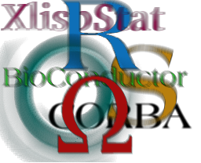

**News**: [call for proposals](/useR-2021_call.html) to host useR! 2021 (deadline now passed).

The R Foundation actively supports two conference series, organized regularly by members from the R community:

* useR!, providing a forum to the R user community.
* DSC, a platform for developers of statistical software.

A rough outline of the format for the respective conferences is given below; both conference formats were developed by the [Austrian Association for Statistical Computing (AASC)](http://www.aasc.or.at/) in cooperation with the [R Foundation for Statistical Computing](https://www.r-project.org/foundation).

The R Foundation also [endorses a small number of conferences](#other-conferences-endorsed-by-the-r-foundation) for special events or to encourage the development of the local R community in under-supported regions.

Conference-related activities are co-ordinated by the *"R Foundation Conference Committee"* (RFCC) currently consisting of
[Julie Josse (Ecole Polytechnique)](http://juliejosse.com/), [Heather Turner](http://www.heatherturner.net/) and [Achim Zeileis (Universität Innsbruck)](http://statmath.wu.ac.at/~zeileis/) plus ex officio [secretary and treasurer](foundation/board.html) of the R Foundation. The RFCC can be contacted by email at <R-conferences@r-project.org>.

The R Foundation has a [policy](/coc-policy.html) requiring a [code of conduct](/coc.html) at R conferences.

------------

## useR! --- International R User Conference

\

[useR! 2020](https://user2020.r-project.org/) will be held in St. Louis, Missouri from 
July 7 to July 10 at the Marriott St. Louis Grand. 
Follow ['@useR2020stl'](https://twitter.com/useR2020stl) on Twitter for further news.

The [call for proposals](/useR-2021_call.html) to host useR! 2021 is now closed. For updates, follow 
['@_R_Foundation'](https://twitter.com/_r_foundation) on Twitter. Announcements are also made on 
the low-volume [R-Announce mailing list](https://stat.ethz.ch/mailman/listinfo/r-announce) (posts to R-Announce go to the [R-help mailing list](https://stat.ethz.ch/mailman/listinfo/r-help) as well).

useR! is the main meeting of the R user and developer community, its program consisting of both invited and user-contributed presentations:

-   The invited keynote lectures cover a broad spectrum of topics ranging from technical and R-related computing issues to general statistical topics of current interest.
-   The user-contributed presentations are submitted as abstracts prior to the conference and may be related to (virtually) any R-related topic. The presentations are typically organized in sessions of regular talks, lightning talks, and poster presentations.
-   The RFCC welcomes expressions of interest from potential local organisers. Groups thinking about hosting a useR! conference are welcome to contact the RFCC by email at <R-conferences@r-project.org>.

Usually, no proceedings are published for useR! conferences.

<!-- NB: Not in SVN: Rather server-side "rewrites" and server-only copies : -->

* [useR! 2020](https://user2020.r-project.org/), St Louis, MO, USA.

* [useR! 2019](https://user2019.r-project.org/), Toulouse, France.
  ([local copy](https://www.r-project.org/conferences/useR-2019)).

* [useR! 2018](https://user2018.r-project.org/), Brisbane, Australia.
  ([local copy](https://www.r-project.org/conferences/useR-2018)).

* [useR! 2017](https://user2017.r-project.org/), Brussels, Belgium.
  ([local copy](https://www.r-project.org/conferences/useR-2017)).

* [useR! 2016](https://user2016.r-project.org/), Stanford, CA, USA.
  ([local copy](https://www.r-project.org/conferences/useR-2016)).

* [useR! 2015](https://user2015.r-project.org/), Aalborg, Denmark.
  ([local copy](https://www.r-project.org/conferences/useR-2015)).

* [useR! 2014](https://user2014.r-project.org/), Los Angeles, CA, USA.
  ([local copy](https://www.r-project.org/conferences/useR-2014)).

* [useR! 2013](https://user2013.r-project.org/), Albacete, Spain
  ([local copy](https://www.r-project.org/conferences/useR-2013)).

* [useR! 2012](https://user2012.r-project.org/), Nashville, TN, USA
  ([local copy](https://www.r-project.org/conferences/useR-2012)).

* [useR! 2011](https://user2011.r-project.org/), Coventry, UK
  ([local copy](https://www.r-project.org/conferences/useR-2011)).

* [useR! 2010](https://user2010.r-project.org/), Gaithersburg, MD, USA.
  ([local copy](https://www.r-project.org/conferences/useR-2010)).

* [useR! 2009](https://user2009.r-project.org/),
  Rennes, France ([local copy](https://www.r-project.org/conferences/useR-2009)).

* [useR! 2008](https://user2008.r-project.org/), Dortmund, Germany
  ([local copy](https://www.r-project.org/conferences/useR-2008)).

* [useR! 2007](https://user2007.r-project.org/), Ames, IA, USA
  ([local copy](https://www.r-project.org/conferences/useR-2007)).

* [useR! 2006](https://user2006.r-project.org/), Vienna, Austria
  ([local copy](https://www.r-project.org/conferences/useR-2006)).

* [useR! 2004](https://user2004.r-project.org/), Vienna, Austria
  ([local copy](https://www.r-project.org/conferences/useR-2004)).

## DSC --- Directions in Statistical Computing

\

DSC is a conference for the developers of statistical software and researchers in statistical computing which is somewhat focused on but not exclusively devoted to R. It aims at providing a platform for exchanging ideas about developments in statistical computing (rather than \`only' the usage of statistical software for applications).

DSC has had two different incarnations. The first was a biennial conference series from 1999 to 2009 with open registration, an open call for papers and peer-reviewed conference proceedings. After a 5 year hiatus, DSC resumed in 2014 as an annual conference coinciding with the General Assembly of the R Foundation. For 2020, speakers will be invited, but there will be open registration.

* DSC 2020, St Louis, MO, USA.

* DSC 2019, Stanford, CA, USA.

* DSC 2018, Stanford, CA, USA.

* [DSC 2017](/dsc/2017), Brussels, Belgium.

* [DSC 2016](/dsc/2016), Stanford, USA.

* [R Summit 2015](http://info.cbs.dk/rsummit2015), Copenhagen, Denmark.

* [DSC 2014](http://www.huber.embl.de/dsc/), Bressanone-Brixen, Italy.

* [DSC 2009](https://www.r-project.org/dsc-2009/), Copenhagen, Denmark
  ([local copy](https://www.r-project.org/conferences/DSC-2009)).

* [DSC 2007](http://www.stat.auckland.ac.nz/dsc-2007/), Auckland, New Zealand
  ([local copy](https://www.r-project.org/conferences/DSC-2007), proceedings have
  been published as issue
  [24/2 of Computational Statistics](https://link.springer.com/journal/180/24/2)).

* DSC 2005, Seattle, USA
  ([local copy](https://www.r-project.org/conferences/DSC-2005)).

* [DSC 2003](http://www.ci.tuwien.ac.at/Conferences/DSC-2003), Vienna, Austria
  ([local copy](https://www.r-project.org/conferences/DSC-2003),
  [proceedings](https://www.r-project.org/conferences/DSC-2003/Proceedings/index.html)).

* [DSC 2001](http://www.ci.tuwien.ac.at/Conferences/DSC-2001), Vienna, Austria
  ([local copy](https://www.r-project.org/conferences/DSC-2001),
  [proceedings](https://www.r-project.org/conferences/DSC-2001/Proceedings/index.html)).

* [DSC 1999](http://www.ci.tuwien.ac.at/Conferences/DSC-1999), Vienna, Austria
  ([local copy](https://www.r-project.org/conferences/DSC-1999)).

##  Other Conferences Endorsed by The R Foundation

### Special Events

* [celebRation](http://www.celebration2020.org/) 28-29 February 2020, Copenhagen, Denmark. A two-day celebration of workshops and invited talks to mark the 20th anniversary of the release of R version 1.0.0.

### Events in under-supported regions

Selected conferences are endorsed by the R Foundation to encourage the development of useR!-like meetings in regions currently beyond the reach of useR!. The aim is to strengthen the local useR community, particularly in academic and scientific research. These meetings may have official languages other than English.

* [R@IIRSA](https://r-iisa2019.rbind.io/) [English] December, 2019, Mumbai, India.
* [ConectaR](https://www.conectar2019.org) [Spanish] January, 2019, San José, Costa Rica.
* [LatinR](http://47jaiio.sadio.org.ar/index.php?q=node/125) [Spanish/Portuguese/English] September 2018, Buenos Aires, Argentina.
* [R Day](http://rday.leg.ufpr.br/) [Portuguese] May 2018, Curitiba, Brazil.

