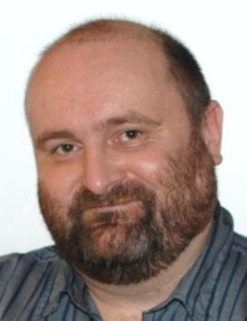

# Fritz Leisch 1968-2024

We are deeply saddened to announce that our friend and colleague
Friedrich (Fritz) Leisch has died.

Fritz obtained his Masters and Doctorate from the Vienna University of
Technology (TU Wien). In 1994, he joined the Department of Statistics
and Probability Theory at TU Wien as an assistant professor. He moved
to the University of Munich (LMU München) in 2006 as a professor for
Computational Statistics in the Institute of Statistics, becoming head
of department in 2010. He returned to Vienna in 2011 to join the
University of Natural Resources and Life Sciences (BOKU) as head of
the Institute of Applied Statistics and Computing.

Fritz’s contributions to statistical computing began in the early days
of the R project when he was a pioneer of many important
innovations. He was among the first developers who joined Ross Ihaka
and Robert Gentleman to form the R Core Development Team in 1997. He
co-founded the Comprehensive R Archive Network (CRAN) with Kurt
Hornik, and developed much of the R package management system. He was
a founding member of the editorial board of R News, which later
evolved into The R Journal, and was the first Secretary General of the
R Foundation for Statistical Computing when it was formed in
2003. Together with Kurt Hornik, Fritz organized the inaugural workshop on
“Distributed Statistical Computing” (DSC) in Vienna in March 1999,
which brought the R Core Team together for its first face-to-face
meeting. Two further DSC conferences were held in 2001 and 2003,
followed by the first useR! conference in 2004. These meetings did
much to make Vienna the spiritual home of R.

Fritz was the first to apply literate programming concepts to the R
language by developing the Sweave system that combines R and LaTeX in
a single document. This introduced reproducible research to the R
language and allowed the first package vignettes to be created,
greatly enhancing the quality of R package documentation.

In addition to his contributions to the R project, Fritz’s research
interests covered many areas including statistical computing, market
segmentation, biostatistics, econometrics, classification, cluster
analysis, time series analysis, software development and statistical
applications in economics, management science and biomedical
research. He taught generations of students at bachelor, master, and
PhD level and introduced hundreds of useRs to proper R development in
his "Introduction to R Programming" short course.

The R Core Team and the R community at large will miss a contributor,
collaborator, teacher, colleague, and friend.