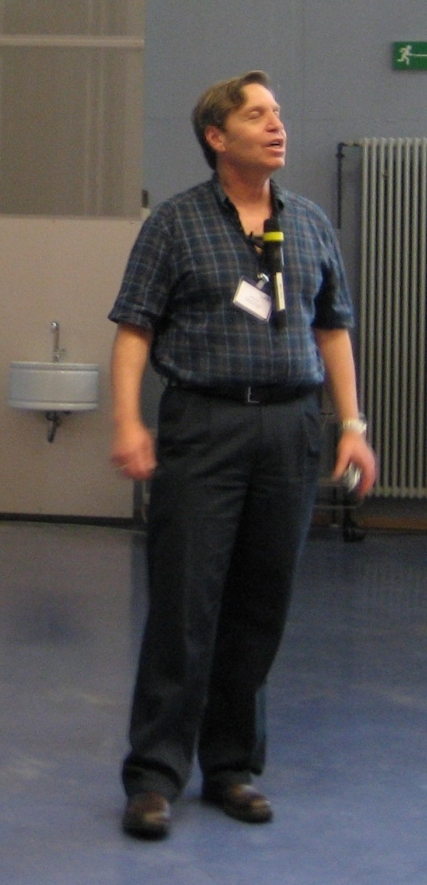

\ 

John Fox passed away on November 26th, 2025. This was sad news, although not unexpected. John had retired from the R Foundation in March 2023, citing health issues. He had been an elected member since 2006.

With a background as a user of S-PLUS, for which his `car` software was originally written, John became  a very early adopter of R and was active on the R mailing lists even before R 1.0.0 in 2000. He remained active in the following decades and was answering questions on R-help as late as mid-2025.

John authored several R packages, notably `Rcmdr`, `sem`, `car`, and `ivreg`, and also wrote several books.

The `sem` package was the first widely used implementation of structural equation models in R. 

`Rcmdr`, documented in his 2017 book, has been widely used as an introduction to R, softening the learning curve by leading novice students from a point-and-click interface into using R scripts. 

`car` and the "R Companion to Applied Regression" is full of insights about specifying and interpreting regression models.

"Applied Regression Analysis and Generalized Linear Models" is deliberately software-agnostic, but stands as a testament to his methodological insights and pedagogical skills.

John served on the Editorial Board of R News during its transition to the R Journal, changing it from newsletter status to a proper scientific journal. The convention at the time was that you served for three years and was Editor in Chief in the last year, 2006-2008 in John's case, but he offered to stay on another year to help Vince Carey in the transition phase.

A sociologist by training, John took a particular interest in the social dynamics of the R project. He managed to secure interviews with several R Core members and use them in his 2009 R Journal paper. He later, with Allison Leanage, wrote about the interactions between R and the Journal of Statistical Software.

John was a good-natured and very friendly person, always a pleasure to be with on the occasions we had to meet in person. He did great service to the R community.

_Peter Dalgaard on behalf of The R Foundation_

## References 

Fox J. (2005). The R Commander: A Basic-Statistics Graphical User Interface to R. Journal of Statistical Software, 14(9), 1–42. [doi: 10.18637/jss.v014.i09](https://doi.org/10.18637/jss.v014.i09)

Fox J. (2009). Aspects of the Social Organization and Trajectory of the R Project. The R
Journal, 1(2), 5–13. [doi:10.32614/rj-2009-014](https://doi.org/10.32614/rj-2009-014)

Fox, J., & Leanage, A. (2016). R and the Journal of Statistical Software. Journal of Statistical Software, 73(2), 1–13. [doi:10.18637/jss.v073.i02](https://doi.org/10.18637/jss.v073.i02)

Fox, J. (2016). Applied Regression Analysis and Generalized Linear Models (3rd ed.). SAGE Publications. 

Fox, J. (2017). Using the R Commander: A Point-and-Click Interface for R. Chapman and Hall/CRC. 

Fox, J., & Weisberg, S. (2019). An R Companion to Applied Regression (3rd ed.). SAGE Publications.

[John's Wikipedia entry](https://en.wikipedia.org/wiki/John_Fox_%28sociologist%29)
